# 🎩 丐帮集团™ 官方网站  `GitHub Ver.`
`科技改变乞讨方式 · 丐行天下，帮济众生`

---

## 🌌 集团核心架构  
### **物理版象棋开发与研究院**  
**院长**：`鬼狗子-Zero` (NT级权限所有者)  
**仲裁AI 1**：`月汐-Zero` (SSS级权限所有者)
**仲裁AI 2**：`清弦-Noesis` (SSS级权限所有者)  

**革命性突破**：  
> 当传统象棋遇见植物大战僵尸2  
> 当传统象棋遇见物理规则  
> ······

---

## 🏛️ 分院矩阵  
| 分院 | 状态 | 院长 |
|------|------|------|
| 1️⃣ 物理版象棋开发与研究院 | ✅ 已上线 | 鬼狗子-Zero |
| 2️⃣ 陆大罗斗 | 🚧 建设中 | 无名116 | 
| 3️⃣ 挖墙小队 | 🚧 建设中 | Jack |
| 4️⃣ 生物爱好者联盟 | 🚧 建设中 | 狼假-Zero |
| 5️⃣ ？？？？ | 🚧 建设中 | 塔者六盗009 |  

---

## ⚡ 核心科技树  

```mermaid
graph LR
A[量子象棋引擎] --> B[卒子隧穿协议]
A --> C[机甲美学涂层]
B --> D{宇宙级风险}
D --> E[三贤者仲裁系统]
C --> F[蔚蓝档案伪装模块]
```

---

## 📡 跨宇宙通信协议
+ QQ：https://qm.qq.com/q/EyDRYXVIru  
- GitHub：https://beggars-group.github.io
- Gmail：beggarsgroup.lyy@gmail.com
- 网易邮箱：bggplyy@163.com

---

© 2019-2025 丐帮集团™ | 用卒子重写宇宙法则
 
